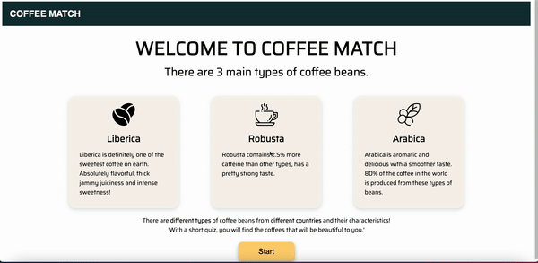

# Coffee-Match #
"I finally found the most suitable coffee bean for me!" - unknown user -


# Project Overview
- This MVP project was built solo at Hack Reactor in 2 days, Jan 25-26 2022.
- This app allows user to find the most suitable coffee bean for them based on the survey.
## Problem ##
 - Many people does not know about their preference on coffee bean.

## Solution ##
- This app takes a survey from the user and recommend the most suitable coffee bean for the user.

## How to Get Started ##

```bash
1.  npm install
2.  npm run build-prod
3.  npm run react-dev
4.  npm run start
5.  localhost:3000
```
